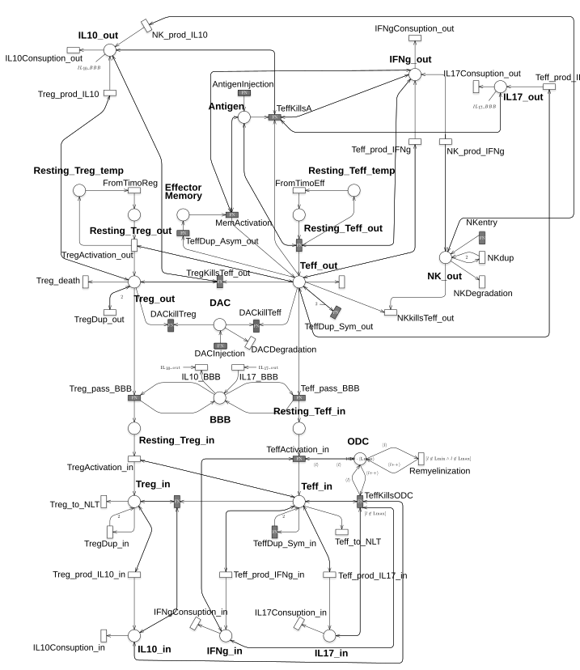

# Multiple-Sclerosis
-   [Workflow](#workflow)
-   [Repository structure](#repository-structure)
-   [Multiple-Sclerosis model](#Multiple-Sclerosis-model)
-   [References](#references)

Workflow
========

All the reported experiments were performed using
[Epimod](https://github.com/qBioTurin/epimod), a tool recently developed
by our group to provide a general framework to draw and analyze
epidemiological systems.

Repository structure
====================

Folders:

1.  **Results**: here all the dynamics obtained through the analysis are reported;
2.  **Net**: the PNPRO file corresponding to the Extended Stochastic
    Symmetric Net (ESSN) (Pernice et al. 2019) exploited to model the MS,
    and the solver (which should be generated before starting
    the analysis) are stored;
3.  **cpp**: the C++ code regarding the general transition of the ESSN;
4.  **R\_func**: here are stored all the R scripts to generate the plots
    and to run the analysis;
5.  **input**: contains all the csv file (e.g., reference, parameter
    lists) necessary to run the analysis;
6.  **Plot**: contains the plots showed in the main paper.
7.  **CalibrationMain** and **Different_therapy** are the Rscripts used to run the *Epimod* functions.

Multiple-Sclerosis model
==============

Fig.1) MS Model represented by exploiting the ESSN graphical formalism.

In Figure 1 is showed the ESSN model representing the cellular interactions characterizing the immunopa\-thology of RRMS. The model consists of 26 places and 55 transitions, of these 42 are standard and 15 general. In details, the model is divided in two compartments: the peripheral lymph node/blood vessel and the CNS. The two compartments interact with each other through the place BBB. All the transitions describing interactions occurring in peripheral lymph node/blood vessel have the suffix *\_out* while all the transitions taking place in CNS have the suffix *\_in*.

A detailed description of the model is reported in the main paper and Supplementary Material.
